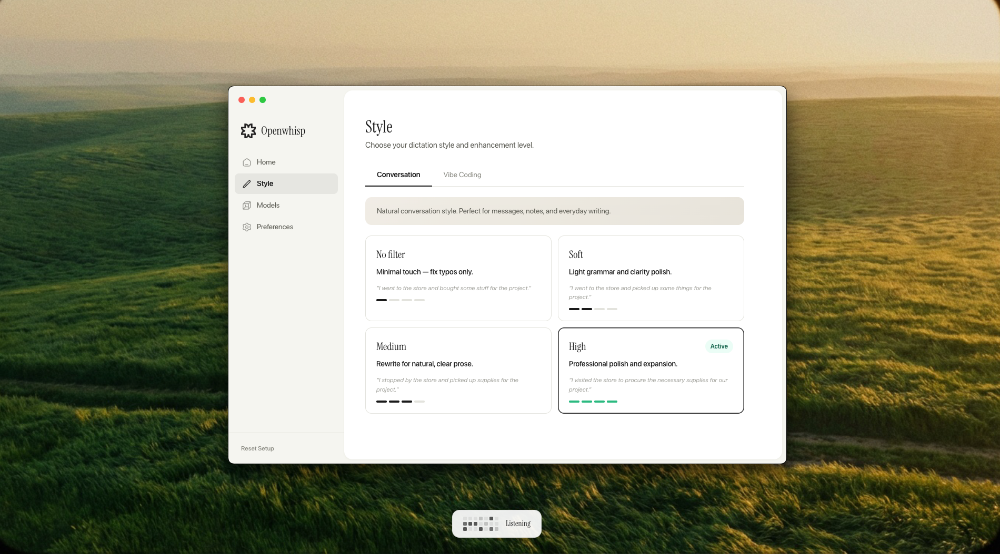

# OpenWhisp Enhanced



**Free WisprFlow alternative.** Hold **Fn**, speak, release. Your words are transcribed via cloud AI, polished by a local LLM, and pasted right where you need them. German-optimized, works with any language.

> Enhanced fork of [OpenWhisp](https://github.com/giusmarci/openwhisp) by [Raelume](https://raelume.ai). Adds cloud transcription, smaller/faster models, and multi-language support.

## What's different from the original?

| Feature | Original OpenWhisp | Enhanced |
|---|---|---|
| **Transcription** | Local only (Whisper Base, 150 MB) | Cloud via Groq (Whisper Large v3) + local fallback |
| **Accuracy** | Basic | Significantly better (Large v3 vs Base) |
| **Text model** | gemma4:e4b (9.6 GB) | qwen3.5:2b (2.7 GB), 3.5x smaller |
| **Language** | English-focused | German-optimized (configurable to any language) |
| **Cloud cost** | None (all local) | Free (Groq Free Tier: 2 hours of audio per day) |
| **RAM usage** | ~12 GB (Whisper + Gemma 4) | ~3 GB (only Ollama LLM, transcription runs in the cloud) |
| **API key security** | N/A | Encrypted via macOS Keychain |
| **Offline mode** | Yes | Yes (automatic fallback to local Whisper) |

## How it works

1. **Hold Fn** to start recording
2. **Speak** naturally
3. **Release Fn** and the pipeline kicks in:

```
Audio -> Groq Whisper Large v3 (cloud, free)
           |
           v
      Raw text (in your language)
           |
           v
      Ollama qwen3.5:2b (local, 2.7 GB)
           |
           v
      Polished text -> Clipboard -> Auto-paste
```

No internet? No problem. OpenWhisp automatically falls back to local Whisper.

## Features

- **Cloud + Local Hybrid**: Groq for best accuracy, local Whisper as offline fallback
- **Tiny LLM**: qwen3.5:2b (2.7 GB) instead of 9.6 GB, runs on any Mac
- **3 Transcription Modes**: Auto (cloud + fallback), Cloud-only, Local-only
- **Styles**: Conversation and Vibe Coding modes
- **4 Enhancement Levels**: No Filter, Soft, Medium, High
- **Intent Resolution**: "Make it white... actually, black" resolves to final intent only
- **Auto-Paste**: Text is pasted directly into the active app
- **Encrypted API Key**: Stored via macOS Keychain, never in plaintext
- **Configurable Provider**: Groq, OpenAI, Lemonfox.ai, or any OpenAI-compatible provider
- **Language Selector**: German, English, French, Spanish, and 90+ more

## Why Groq?

| Provider | Price/min | Model | Free Tier |
|---|---|---|---|
| **Groq** | $0.0002 | Whisper Large v3 | 7,200 sec/hr (~2 hrs of audio per day, free) |
| OpenAI | $0.006 | Whisper v2 | None |
| Lemonfox | $0.003 | Whisper Large v3 | 1 month free |

Groq is **30x cheaper than OpenAI** and offers a generous free tier. For normal usage (a few minutes of dictation per day), it is **completely free**.

## Quick Start

### 1. Install Ollama and pull the text model

```bash
# Install Ollama: https://ollama.com/download/mac
ollama serve

# Pull the text enhancement model (only 2.7 GB!)
ollama pull qwen3.5:2b
```

### 2. Get a Groq API key (free)

1. Go to [console.groq.com](https://console.groq.com)
2. Create an account (free)
3. Generate an API key

### 3. Download the app

Grab the latest `.dmg` from [Releases](https://github.com/nicremo/openwhisp-enhanced/releases), open it and drag OpenWhisp to your Applications folder.

Since the app is not signed with an Apple Developer certificate, macOS will block it on first launch. Run this once in Terminal to allow it:

```bash
xattr -cr /Applications/OpenWhisp.app
```

Then open OpenWhisp normally. You only need to do this once.

### 3b. Or build from source

```bash
git clone https://github.com/nicremo/openwhisp-enhanced.git
cd openwhisp-enhanced
npm install
npm run build:native
npm run dev
```

### 4. Setup Wizard

The setup wizard walks you through:

1. **Transcription Engine**: Enter your Groq API key (or download local Whisper as fallback)
2. **Ollama**: Verify the connection
3. **Permissions**: Microphone, Accessibility, Input Monitoring

After setup: hold **Fn**, speak, release. Done.

## Changing the language

The app defaults to German. To switch to English (or any other language):

1. Open the **Models** page
2. Change the **Language** dropdown to your language
3. Done. Both transcription and LLM rewrite will use your selected language.

Supported: German, English, French, Spanish, Italian, Portuguese, Dutch, Polish, Japanese, Chinese, Korean, and 90+ more via Whisper.

## Models

| Purpose | Model | Size | Provider |
|---|---|---|---|
| Transcription (cloud) | Whisper Large v3 | Cloud | Groq (free) |
| Transcription (local) | whisper-base | ~150 MB | Local via HuggingFace |
| Text enhancement | qwen3.5:2b | ~2.7 GB | Local via Ollama |

### Alternative Cloud Providers

The app works with any OpenAI-compatible provider. Just change the Base URL and API key on the Models page:

| Provider | Base URL | Model |
|---|---|---|
| Groq (default) | `https://api.groq.com/openai` | `whisper-large-v3` |
| OpenAI | `https://api.openai.com` | `gpt-4o-mini-transcribe` |
| Lemonfox | `https://api.lemonfox.ai` | `whisper-1` |

### Alternative Text Models

Any Ollama model works. Recommendations by size:

| Model | Size | Quality | Speed |
|---|---|---|---|
| qwen3.5:2b (default) | 2.7 GB | Very good | Fast |
| qwen3:4b | 2.5 GB | Excellent | Fast |
| gemma3:4b | 3.3 GB | Excellent | Medium |
| qwen3.5:4b | 3.4 GB | Top tier | Medium |

## Tech Stack

- **Electron** + **React** + **TypeScript** for the desktop shell and UI
- **Groq API** (or any OpenAI-compatible provider) for cloud transcription
- **@huggingface/transformers** for local Whisper inference (offline fallback)
- **Ollama** for local LLM text enhancement
- **Swift** native macOS helper for Fn key listening, focus detection, and paste simulation
- **electron-vite** for build tooling
- **Electron safeStorage** for encrypted API key storage via macOS Keychain

## Project Structure

```
src/
  main/
    api-key.ts              # API key encryption (macOS Keychain)
    cloud-transcription.ts  # Cloud STT (Groq/OpenAI-compatible)
    dictation.ts            # Pipeline: transcribe -> rewrite -> paste
    transcription.ts        # Local Whisper inference (fallback)
    ollama.ts               # Ollama API client + auto-launch
    prompts.ts              # Prompt matrix (style x enhancement level)
    settings.ts             # Settings persistence
    windows.ts              # Window management
  renderer/
    App.tsx                 # UI: sidebar, pages, setup wizard, overlay
    styles.css              # Styling
    audio-recorder.ts       # Web Audio recorder with level metering
  preload/                  # Electron preload bridge
  shared/                   # Shared types and constants
swift/
  OpenWhispHelper.swift     # Native macOS helper
```

## Building for distribution

```bash
npm run package
```

Builds the Electron app, compiles the Swift helper, and packages everything into a `.dmg` and `.zip` in the `release/` directory.

## Credits

- Original [OpenWhisp](https://github.com/giusmarci/openwhisp) by [GiusMarci](https://x.com/GiusMarci) / [Raelume](https://raelume.ai)
- Enhanced version by [Fabian](https://github.com/nicremo)

## License

MIT (same as the original)
